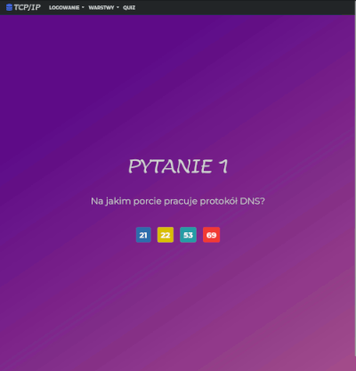
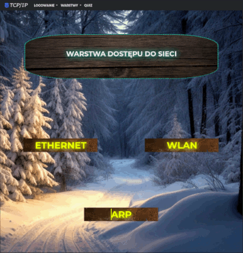
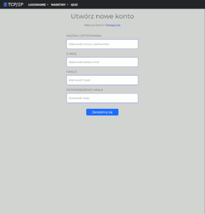

# Web application about TCP/IP model

This project is a web application developed using Flask, designed to educate students about the TCP/IP model. It provides detailed information on the different layers and protocols of TCP/IP and includes interactive features such as quizzes to assess understanding.

## Features

- **Educational Content**: Detailed information about each layer of the TCP/IP model and their associated protocols.
- **User Authentication**: Secure user login and registration.
- **Interactive Quizzes**: Test your knowledge with quizzes on TCP/IP concepts.
- **Responsive Design**: Frontend styled with Bootstrap for a responsive and modern interface.

## Screenshots






## Installation

To set up the project on your local machine, follow these steps:

1. **Clone the Repository**:

   ```sh
   git clone https://github.com/Gibirizon/web-app-tcp-ip.git
   cd web-app-tcp-ip
   ```

2. **Create a Virtual Environment**:

   ```sh
   python3 -m venv venv
   source venv/bin/activate  # On Windows use `venv\Scripts\activate`
   ```

3. **Install Dependencies**:

   ```sh
   pip install -r requirements.txt
   ```

4. **Run the Application**:

   ```sh
   flask --app main run
   ```

5. **Access the Application**:
   Open your web browser and navigate to `http://127.0.0.1:5000/home`.

## Usage

- **Home Page**: Overview of the TCP/IP model.
- **User Authentication**: Register and log in to access quizzes.
- **TCP/IP Information**: Navigate through detailed pages about each layer and protocol.
- **Quizzes**: Test your knowledge on the TCP/IP model.

---

Made by Gibirizon :heart:
